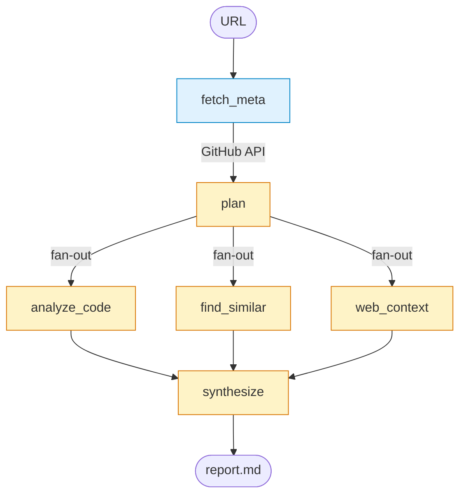

# Repo Analyzer

[](https://github.com/nozikov/github-repo-analyzer/actions/workflows/test.yml)
[](https://www.python.org/downloads/)
[](LICENSE)
[](https://github.com/langchain-ai/langgraph)
[](https://www.anthropic.com/claude)
[](https://github.com/astral-sh/uv)

Учебный LangGraph-агент: принимает URL публичного GitHub-репозитория и выдаёт markdown-отчёт из трёх секций — tech due-diligence, советы автору, идеи продуктов поверх технологии.

## Установка

```bash
uv sync
cp .env.example .env
# открой .env и впиши три ключа
```

## Запуск

```bash
uv run python -m repo_analyzer https://github.com/tiangolo/typer
```

Отчёт пишется в `reports/<owner>-<repo>-<date>.md` и одновременно печатается в stdout.

## Как работает

Граф из 5 узлов. Три параллельные ветки сливаются в финальный синтезатор:



- **`fetch_meta`** — тянет метаданные репо, README и file_tree из GitHub API.
- **`plan`** — Claude решает, какие файлы читать, какой запрос на похожие репо отправить и какие веб-запросы.
- **`analyze_code` / `find_similar` / `web_context`** — три ветки идут одновременно, каждая собирает свой кусок контекста.
- **`synthesize`** — собирает всё в финальный markdown с тремя секциями.

Полное описание архитектуры, контракты узлов, обработка ошибок и roadmap — в [docs/architecture.md](docs/architecture.md).

## Тесты

```bash
uv run pytest -v          # все юнит и smoke тесты с моками
uv run pytest -m live -s  # реальные API (нужны ключи)
```

CI прогоняет юнит-тесты на Python 3.11 и 3.12 на каждый push и PR.

## Стоимость прогона

На среднем репо (10-15 файлов): ~10-30 центов на Claude Sonnet 4.6 + бесплатные tier-ы GitHub и Tavily.

## Contributing

См. [CONTRIBUTING.md](CONTRIBUTING.md). Issues и PR приветствуются.

## Лицензия

[MIT](LICENSE)
