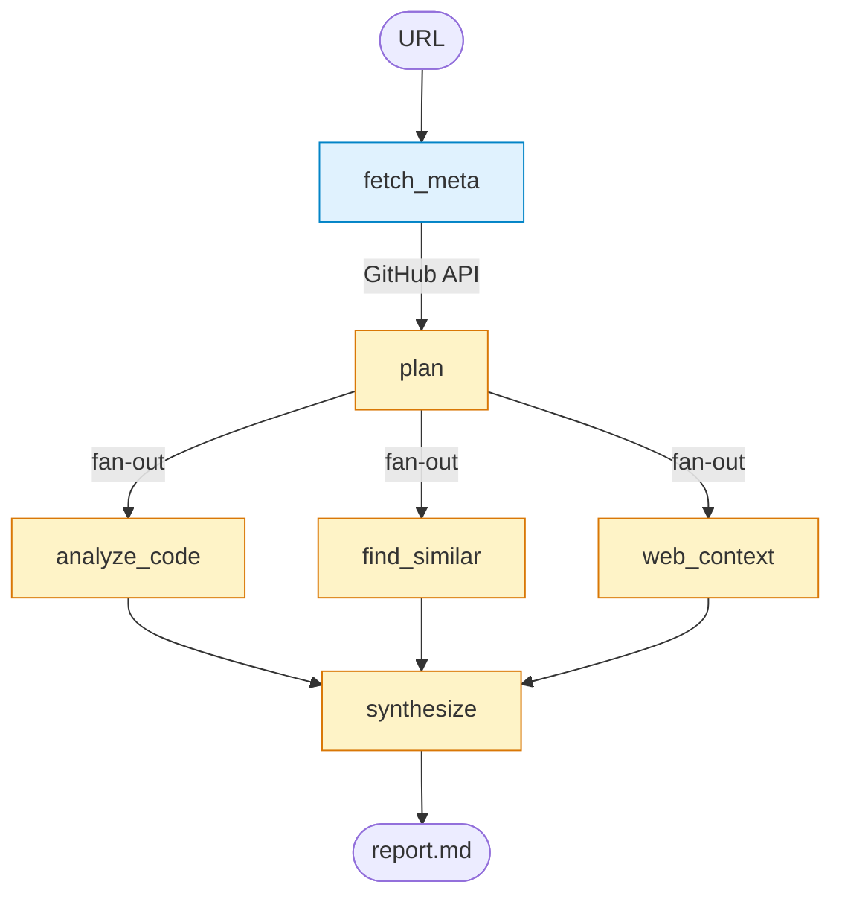

# Архитектура

Документ описывает, как устроен Repo Analyzer изнутри: граф узлов, state, контракты, обработка ошибок и план развития.

## Обзор

Repo Analyzer — LangGraph-агент с детерминированной топологией. На вход URL публичного GitHub-репо, на выход markdown-отчёт из трёх секций. Между ними — пять узлов, три из которых работают параллельно. Управление потоком статическое, без conditional edges и без LLM-«роутера».

Каждый узел — чистая функция `State → partial State`. I/O изолировано в `tools/`, промпты — в `prompts/`. Граф собирается в `graph.py` — после прочтения этого файла понятно, как всё работает.

## Граф



Голубым — узлы только с I/O, жёлтым — с LLM-вызовами. После `plan` три ветки идут одновременно, их результаты сливаются в `synthesize` через reducer-аннотации (`Annotated[list, add]`).

## State

```python
from typing import Annotated, TypedDict
from operator import add

class RepoMeta(TypedDict):
    owner: str
    name: str
    description: str
    stars: int
    language: str
    topics: list[str]
    readme: str
    manifest: dict           # parsed package.json/pyproject.toml/etc
    file_tree: list[str]

class CodeFinding(TypedDict):
    path: str
    summary: str
    quality_notes: list[str]

class SimilarRepo(TypedDict):
    full_name: str
    description: str
    stars: int
    why_similar: str
    differentiator: str

class WebSnippet(TypedDict):
    url: str
    title: str
    relevant_quote: str

class Plan(TypedDict):
    files_to_read: list[str]
    similar_repos_query: str
    web_queries: list[str]

class State(TypedDict):
    repo_url: str
    meta: RepoMeta
    plan: Plan
    code_findings: Annotated[list[CodeFinding], add]
    similar_repos: Annotated[list[SimilarRepo], add]
    web_snippets:  Annotated[list[WebSnippet], add]
    report_markdown: str
```

`Annotated[list, add]` — встроенный LangGraph-reducer для объединения значений из параллельных веток (list-конкатенация).

## Контракты узлов

| Узел | Читает | Пишет | LLM-вызовы | Внешние API |
|------|--------|-------|------------|-------------|
| `fetch_meta` | `repo_url` | `meta` | — | GitHub (3 calls) |
| `plan` | `meta` | `plan` | 1 (structured) | — |
| `analyze_code` | `meta`, `plan.files_to_read` | `code_findings` | по 1 на файл | GitHub raw |
| `find_similar` | `plan.similar_repos_query` | `similar_repos` | 1 (structured) | GitHub Search |
| `web_context` | `plan.web_queries` | `web_snippets` | 1 на запрос (structured) | Tavily |
| `synthesize` | весь state | `report_markdown` | 1 | — |

## Узлы по шагам

### `fetch_meta`

Чистый I/O, без LLM. Делает три запроса к GitHub:

- `GET /repos/{owner}/{name}` → description, stars, language, topics
- `GET /repos/{owner}/{name}/readme` → README в base64
- `GET /repos/{owner}/{name}/git/trees/HEAD?recursive=1` → file_tree

Manifest парсится локально: ищется первый из `package.json`, `pyproject.toml`, `Cargo.toml`, `go.mod`, `pom.xml`, `build.gradle`, `build.gradle.kts`. Сырой контент через GitHub raw, парсинг — стандартными библиотеками.

### `plan`

Один LLM-вызов с structured output. Получает `meta` (включая первые ~3000 символов README и список файлов до 500 путей), возвращает валидный `Plan`:

- 5–15 ключевых файлов для чтения (entry points, основные модули, CI/Docker)
- query для GitHub Search для похожих репозиториев
- 2–3 веб-запроса для контекста

### `analyze_code`

Цикл по `plan.files_to_read`. Для каждого файла:

1. GET сырого содержимого. Если файл больше 1MB — fallback на `raw.githubusercontent.com`.
2. Если файл больше 50KB — обрезается до 50KB.
3. LLM-вызов: «опиши, что делает файл, отметь явные проблемы качества». Возвращает `CodeFinding`.

В V1 файлы читаются последовательно. Async-параллелизм — V2.

### `find_similar`

- `GET /search/repositories?q={query}&sort=stars&per_page=10`
- LLM-вызов со structured output: для каждого top-10 кандидата объясняет, чем похож и чем отличается. Сохраняет 3-5 самых релевантных как `SimilarRepo`.

### `web_context`

Для каждого `web_query`:

1. `tavily.search(query, max_results=5)` — возвращает уже сжатые сниппеты.
2. LLM-фильтр: «какие сниппеты реально полезны для анализа `{owner/name}`?». Мусор отбрасывается.

### `synthesize`

Финальный LLM-вызов. Собирает весь state в один промпт и просит Claude написать markdown с обязательной структурой:

```markdown
# Анализ репо {owner/name}

## 1. Tech due-diligence
## 2. Рекомендации автору
## 3. Идеи поверх технологии

## Источники и ограничения
```

Если в выводе нет одной из трёх обязательных секций — узел пишет warning в лог. Файл сохраняется в `reports/{owner}-{name}-{date}.md` и одновременно печатается в stdout.

## Обработка ошибок

| Сценарий | Действие |
|----------|----------|
| GitHub 404 (репо нет/приватный) | Явный fail, `sys.exit(1)` |
| GitHub 5xx | Retry с экспобэкоффом 3 раза (`tenacity`) |
| GitHub 403 rate-limit | На V1 — фейлит. На V2 запланирован sleep до `X-RateLimit-Reset` |
| Tavily timeout/error | Не критично — `web_snippets=[]`, агент продолжает |
| LLM кривой structured output | LangChain ретраит сам; после ошибки узел пишет warning и идёт дальше |
| Файл > 1MB | Fallback на raw.githubusercontent.com |
| Файл > 50KB после загрузки | Обрезается до первых 50KB |
| Огромный репо (>5000 файлов) | `file_tree` для LLM ограничен первыми 500 путями, `files_to_read` ≤ 15 |

**Принцип:** агент не падает целиком из-за частичного провала источника. Пустой `web_snippets` приемлем — отчёт будет строиться на двух остальных ветках.

## Структура проекта

```
lang-graph/
├── README.md
├── CONTRIBUTING.md
├── LICENSE
├── pyproject.toml
├── .env.example
├── .github/workflows/test.yml
│
├── src/
│   └── repo_analyzer/
│       ├── __main__.py             # entry: python -m repo_analyzer <url>
│       ├── cli.py                  # argparse, парсинг URL, запуск графа
│       ├── graph.py                # построение LangGraph
│       ├── state.py                # все TypedDict
│       ├── llm.py                  # singleton ChatAnthropic
│       │
│       ├── nodes/                  # один файл = один узел
│       │   ├── fetch_meta.py
│       │   ├── plan.py
│       │   ├── analyze_code.py
│       │   ├── find_similar.py
│       │   ├── web_context.py
│       │   └── synthesize.py
│       │
│       ├── tools/                  # I/O, изолированно для удобства мокинга
│       │   ├── github.py
│       │   └── tavily.py
│       │
│       └── prompts/                # все LLM-промпты
│           ├── plan.py
│           ├── analyze_code.py
│           ├── find_similar.py
│           ├── web_context.py
│           └── synthesize.py
│
├── tests/
│   ├── conftest.py
│   ├── test_nodes/
│   ├── test_graph_smoke.py
│   ├── test_live.py                # @pytest.mark.live, скипается по умолчанию
│   ├── test_tools_github.py
│   ├── test_tools_tavily.py
│   ├── test_llm.py
│   └── test_cli.py
│
├── docs/
│   └── architecture.md             # этот документ
│
└── reports/                        # в .gitignore
```

## Roadmap (V2 и далее)

V1 намеренно простой. Запланированные направления развития:

- **Reflection loop.** Изначально планировался в V1, но удалён из-за семантических проблем (`Annotated[list, add]` приводил к дубликатам при повторном проходе ветки, plan не обновлялся между итерациями). Корректная реализация требует replace-reducer и gap-aware промптов узлов — это уже не просто +узел в графе, а изменение контракта существующих узлов.
- **Context7 в analyze_code.** Подтягивать актуальные доки фреймворков, обнаруженных в манифесте, и проверять не используются ли deprecated API.
- **Rate-limit handling.** Sleep до `X-RateLimit-Reset` вместо падения на 403.
- **Async-параллелизм внутри `analyze_code`.** `asyncio.gather` по файлам.
- **Self-critique в synthesize.** Двух-шаговый паттерн: draft → критика → финал.
- **RAG-индексирование репозитория** для глубокого анализа кода вместо чтения 5-15 файлов.
- **Persistence** через `MemorySaver` / `SqliteSaver` для возобновления прерванных запусков.
